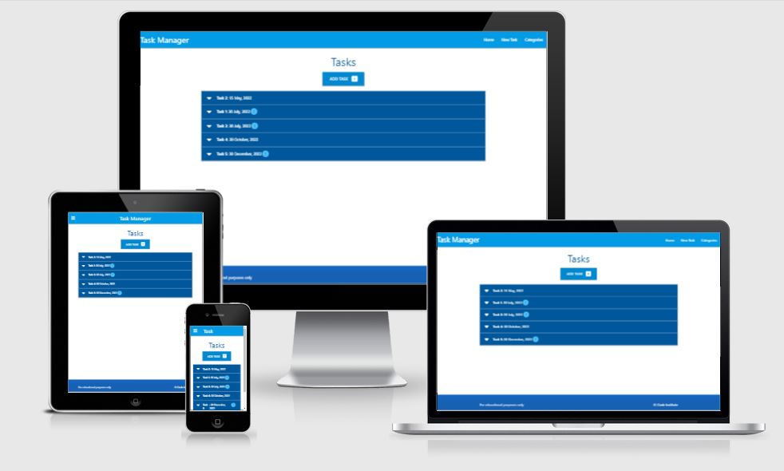

# [Task Manager App](http://flask-sqlalchemy-taskmanagercc.herokuapp.com/)

This is a task manager app and is built using Flask, the SLQAlchemy ORM, and Materialize frontend framework..

In the home page a summary of tasks is displayed. Each of them has the task name, due date, whether or not it's an urgent task. Once we click to expand more, we see the task category, and a description.

Users will be able to create new tasks, view their tasks, edit tasks, delete their tasks and the same for categories.



## Table of contents

1. [Learning outcomes](#Learning-outcomes)
1. [Set up basic Flask app](#Set-up-basic-Flask-app)
1. [Creating the database](#Creating-the-database)
1. [Template inheritance](#Template-inheritance)
1. [Adding categories](#Adding-categories)
1. [Viewing categories](#Viewing-categories)
1. [Updating categories](#Updating-categories)
1. [Deleting categories](#Deleting-categories)
1. [Adding tasks](#Adding-tasks)
1. [Viewing tasks](#Viewing-tasks)
1. [Updating Tasks](#Updating-Tasks)
1. [Deleting tasks](#Deleting-tasks)
1. [Deploying the project to Heroku](#Deploying-the-project-to-Heroku)

## Learning outcomes

This is a [Code Institute](https://codeinstitute.net/) code along project designed to learn:
- how to perform full CRUD functionality, which allows to create, read, update, and delete items on database
- how to create HTML-based user interfaces to demonstrate CRUD calls in action
- how to style these interfaces using the Materialize framework

[Back to top](#Table-of-contents)

---

## Set up basic Flask app using the Flask-SQLAlchemy package

- install 2 Python packages `pip3 install Flask-SQLAlchemy psycopg2`
- store sensitive data using environment variables hidden in env.py. Make sure env.py is in .gitignore.
- the app needs to be it's own Python package. So create `taskmanager` folder
- create `__init__.py` file within the taskmanager package, to initialize our taskmanager application as a package, allowing us to use our own imports, as well as any standard imports
- create the new `routes.py` file within the taskmanager package. In it create a basic app route using the root-level directory of "/"
- create `base.html` template in `templates` folder (which is where Flask looks for any HTML templates to be rendered) within the taskmanager package 
- create the main Python file `run.py` that will actually run the entire application. This will be at the root level of the workspace, not part of the taskmanager package itself.

[Back to top](#Table-of-contents)

---

## Creating the database

The data base if formed of 2 tables: "Category" and "Task"


- create the new `models.py` file within the taskmanager package. In it, create 2 separate tables, Category and Task
- import the 2 classes for the tables in `routes.py`
- create taskmanager database: 
    - `set-pg`
    - `psql`
    - `CREATE DATABASE taskmanager`
- use Python to generate and migrate the 2 models into `taskmanager` database.
    - access the Python interpreter by typing `python3`
    - import the 'db' variable found within the taskmanager package: `>>> from taskmanager import db`
    - perform the .create_all() method: `>>> db.create_all()`
    - exit the Python interpreter: `>>> exit()`

*__Important__ - if you modify the models later, then you'll need to migrate these changes each time the file is updated with new context.*

[Back to top](#Table-of-contents)

---
 
## Template inheritance

Creating the front-end user interface in [Materialize](https://materializecss.com/) to interact with the database. Template inheritance was used to extend the html templates, to avoid duplicating code.
- add the CDN link and script tags from the [Materialize 'Getting Started' page](https://materializecss.com/getting-started.html) to `base.html`
- create folder structure for static files. (taskmanager > static > css and js folders)
- link static files to `base.html` using the correct syntax:
    - `{{ url_for('static_folder', filename='path/filename' ) }}`
- add components from Materialize
    - a mobile collapse navbar - initialize side navbar in js
    - a footer - create sticky footer in css
- start using template inheritance functionality using [Jinja](https://palletsprojects.com/p/jinja/) blocks to inject content
```



    *Insert content here* 

```

*__Important__ - don't forget to use `set_pg` before you start the app with `python3 run.py`*

[Back to top](#Table-of-contents)

---

## Adding categories


Before tasks can be added to the database, we need to have some "Create" functionality that handles the categories. 

Building the front-end template that allows to add new categories to the database.
- create `categories.html` and `add_category.html` templates
- extend the 2 templates from `base.html` template
- create a button that will link the form to add a new category in `categories.html`
- in `routes.py` create a functions that will generate `add_category` and `categories` templates
- create the form to add a category to the database
    - import Materialize text input code and adjust accordingly
    - create an input field for `category name`
    - create an `ADD CATEGORY` submit button
- in `routes.py` create the `POST` method functionality

*__Important__ - don't forget to use `set_pg` before you start the app with `python3 run.py`*

[Back to top](#Table-of-contents)

---

## Viewing categories


Once a category is cretated we need to be able to display it to the user in the "categories" page. To do that we need to create the "Read" functionality.

- from Materialize, import the code for "basic card" into `categories.html`
- adapt the code to suit the project
- edit the links into `EDIT` and `DELETE` buttons
- in `routes.py` build the code that extracts data from database
- in `categories.html` use Jinja syntax of for-loop to display multiple cards
- add more categories to test the functionality

*__Important__ - don't forget to use `set_pg` before you start the app with `python3 run.py`*

[Back to top](#Table-of-contents)

---

## Updating categories

Now that we have the ability to create and retrieve categories, we need to be able to update a category as well.

- duplicate `add_category.html` into `edit_category.html` and modify it accordingly
- in `routes.py` create `edit_category()` function
- in `edit_category.html` modify the "EDIT" button link to `url_for` syntax with 2 args
    - 1st arg: `edit_category` - points to `edit_category()`
    - 2nd arg: `category_id=category.id` - to specify to the app which category to update
- in `routes.py` modify `app.route` to add `category_id` as integer in square brakets
- in `edit_category.html` add `category_id` to the link
- in `routes.py` define the `category` variable so that the function knows which specific category to load
- in `edit_category.html` add `value="{{ category.category_name }}"` to the input field
- in `routes.py` create the `POST` method functionality

*__Important__ - don't forget to use `set_pg` before you start the app with `python3 run.py`*

[Back to top](#Table-of-contents)

---

## Deleting categories

Now that we have 3 of the 4 CRUD functionalities, to Create, Read, and Update records from our database, we need to give the users the ability to delete a category.

- in `routes.py` create `delete_category()` function and get the required functionality from `edit_category()`
- in `categories.html` update the href link to use `url_for` syntax with the same 2 args like edit button

*__Important__*
- *don't forget to use `set_pg` before you start the app with `python3 run.py`*
- *once the delete button is clicked, it will __completely delete__ the record from the database and this is considered __bad practice__. Therefore __defensive programming__ and __user authentication__ should be considered.*

[Back to top](#Table-of-contents)

---

## Adding tasks


The `add_task.html` template will trigger the form to submit via the `add_task()` function, and insert the new record into our database.

- in `tasks.html` create a button that will link the form to add a new task
- update links for task page in `base.html`
- in `routes.py` create `add_task()` function
- create `add_task.html` template
- in `script.js` initialize Materialize "select" and "datepicker" form elements

*__Important__ - don't forget to use `set_pg` before you start the app with `python3 run.py`*

[Back to top](#Table-of-contents)

---

## Viewing tasks

Once a Task is cretated we need to be able to display it to the user in the "Home" page. To do that we need to create the "Read" functionality.

- in `routes.py` modify the `home()` function to extract all of the tasks from our database
- in `tasks.html` template import code for collapsables form Materialize and adapt it accordingly
- in `tasks.html` template use Jinja syntax of for-loop to iterate over each task within our list of all tasks
- in `script.js` initialize "collapsibles" elements form Materialize

*__Important__ - don't forget to use `set_pg` before you start the app with `python3 run.py`*

[Back to top](#Table-of-contents)

---

## Updating Tasks

Now that we have the ability to create and retrieve tasks, we need to be able to update a task as well.
- duplicate `add_task.html` into `edit_task.html` and modify it accordingly
- in `routes.py` create `edit_task()` function
- in `tasks.html` template, within the 'collapsible-body' element add another paragraph tag that contains a link, styled like a button
- in `edit_task.html` modify form's action link
- modify `edit_task.html` to add the existing values into their respective fields
- modify `edit_task.html` to conditionally check to see if 'is_urgent' toggle is set to True, and if so, add the 'checked' attribute
- modify `edit_task.html` for the 'category' selection (our current for-loop is building an option for each category in our database) to conditionally check to see if the current iteration of categories matches the actual task category that is updating
- modify `edit_task.html` for the textarea to remove the white space by using Jinja helper elements

*__Important__ - don't forget to use `set_pg` before you start the app with `python3 run.py`*

[Back to top](#Table-of-contents)

---

## Deleting tasks

Now that we have 3 of the 4 CRUD functionalities, to Create, Read, and Update records from our database, we need to give the users the ability to delete a Task.

- modify `tasks.html` to add a "DELETE" button
- in `routes.py` create `delete_task()` function

*__Important__*
- *don't forget to use `set_pg` before you start the app with `python3 run.py`*
- *once the delete button is clicked, it will __completely delete__ the record from the database and this is considered __bad practice__. Therefore __defensive programming__ and __user authentication__ should be considered.*

[Back to top](#Table-of-contents)

---

## Deploying the project to Heroku

Unfortunately, deploying to GitHub Pages won't work, since it can only handle front-end files
such as HTML, CSS, and JavaScript. So the project needs to be deployed to a hosting platform that can render Python files. One such platform is [Heroku](https://id.heroku.com/login).

- in `requirements.txt` set up the files required by Heroku to run the app:

        `pip3 freeze --local > requirements.txt`

- use `echo web: python run.py > Procfile` to create the Procfile which is what Heroku looks for to know which file runs the app, and how to
run it
- delete the empty line at the end of Procfile file
- add, commit and push the 2 files to GitHub
- sign up / login to [Heroku](https://id.heroku.com/login) website
- create a new app
- create a new database that [Heroku](https://id.heroku.com/login) can host

        *Due to the fact that our database is stored locally in Postgres on our workspace, Heroku cannot see this data.
        Depending on what data you're storing within your database, such as user accounts and personal information, it's recommended to not migrate your existing database to Heroku. 
        Although it is possible, you could risk accidentally exposing confidential data on your GitHub account, if not done properly.*

- in `Resouces` tab underneath the `Add-ons` section type `heroku postgress`
- choose `Hobby Dev - Free` option
- in `Settings` press `Reveal Config Vars` and add the other variables that are currently saved within our `env.py` file. Don't include "DEVELOPMENT" and "DB_URL" variables.
- modify the initialization file `__init__.py` to add a conditional check for Heroku's Postgres database. If the "DEVELOPMENT" environment variable is set to "True", then we are working with our local database. Otherwise, since we didn't set that variable on Heroku, then it should use Heroku's "DATABASE_URL" instead.
- in heroku app under `Deploy` tab choose "Deployment method" as "GitHub"
- choose Repository name and click `Connect`
- choose `Enable Automatic Deploys`
- Choose `Deploy Branch`
- if your DATABASE_URL starts with ‘postgres’ instead of ‘postgresql’, then we need to add one extra bit of code to the `__init__.py` file, since we cannot edit this variable
- add, commit and push `__init__.py` file to GitHub
- create the 2 tables on the database in Heroku:
    - choose `more` and `Run console`
    - type `python3` to access the Python interpreter
    - `from taskmanager import db`
    - `create_all()`
    - `exit()`
- everything should be linked up properly now, so we can finally click on the `Open App` button
- repopulate the database
 
*__Important__*
- *__Remember__, whenever you add additional packages to your project, you must update the **requirements.txt** file for __Heroku__*
- *The local IDE database and the Heroku database are two completely separate databases.*   
    - Something to consider when building your milestone projects, is to only use fake or temporary data during the development stages. 
    Get your project working functionally first, and then, once you've got the app deployed on Heroku, you can start to work with the real data on your Heroku database.
- *__Make sure__ to set "DEBUG" variable to "False" prior to submitting any milestone projects for assessment. The only reason we want "DEBUG" to be "True" temporarily, is to check for any possible errors during setup and deployment.*
- *__Remember__, if you make any changes to your models anytime during development once deployed to Heroku, you will need to make these migrations once again in this Heroku console*

[Back to top](#Table-of-contents)

---

*Disclaimer: this is a code along project from [Code Institute](https://codeinstitute.net/)'s **Database Management Systems** module*